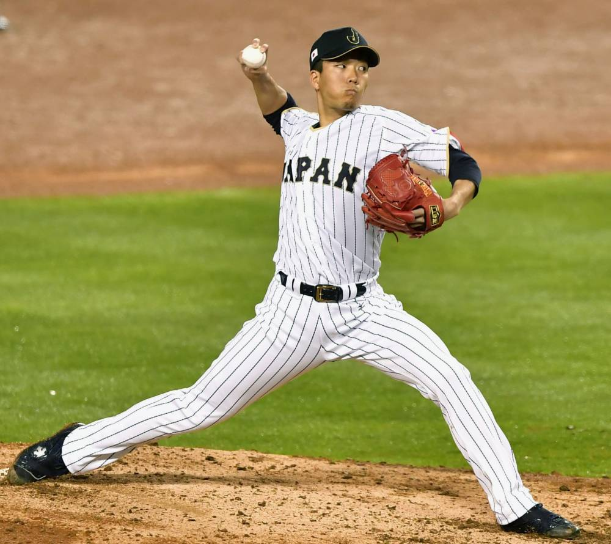
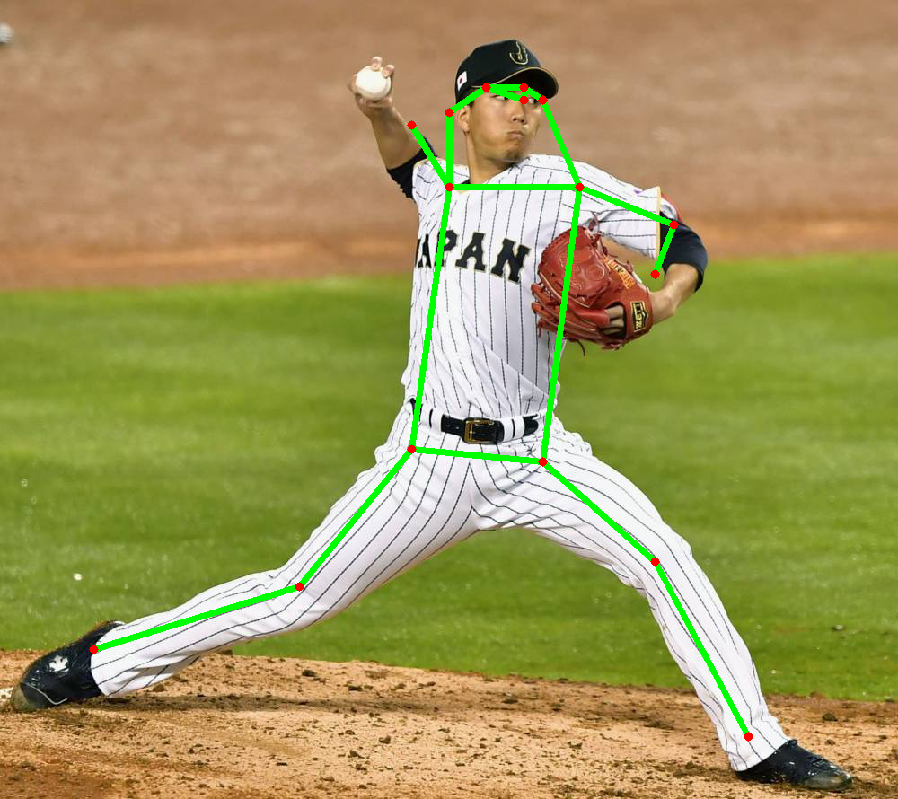
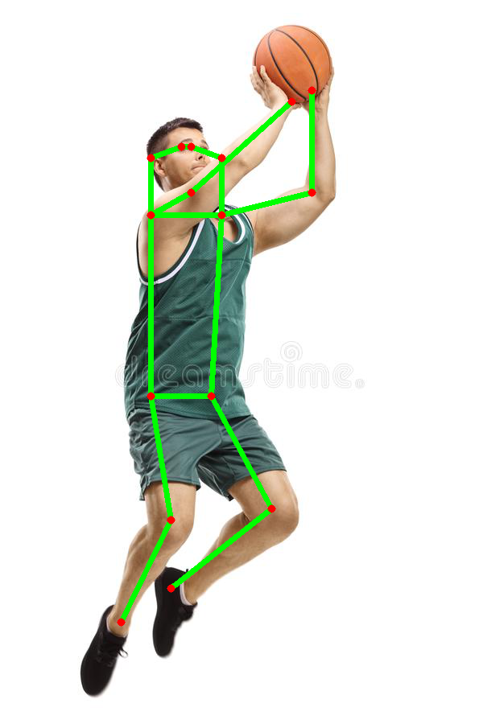
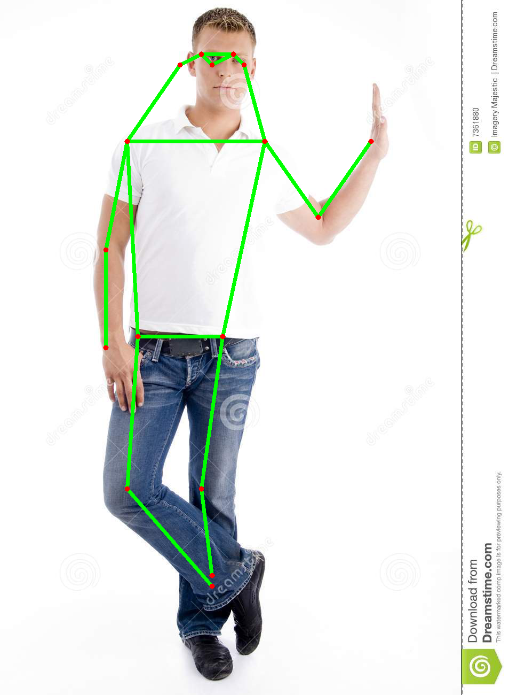
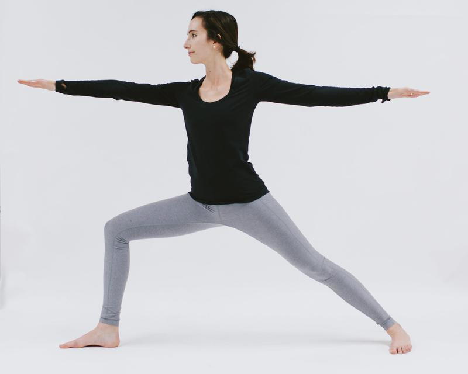
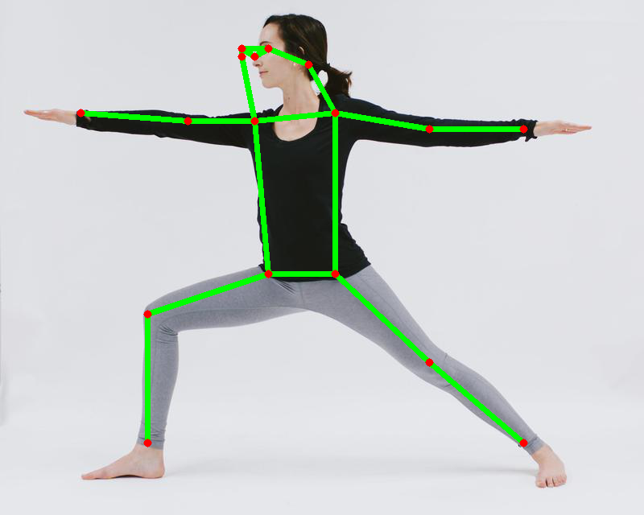
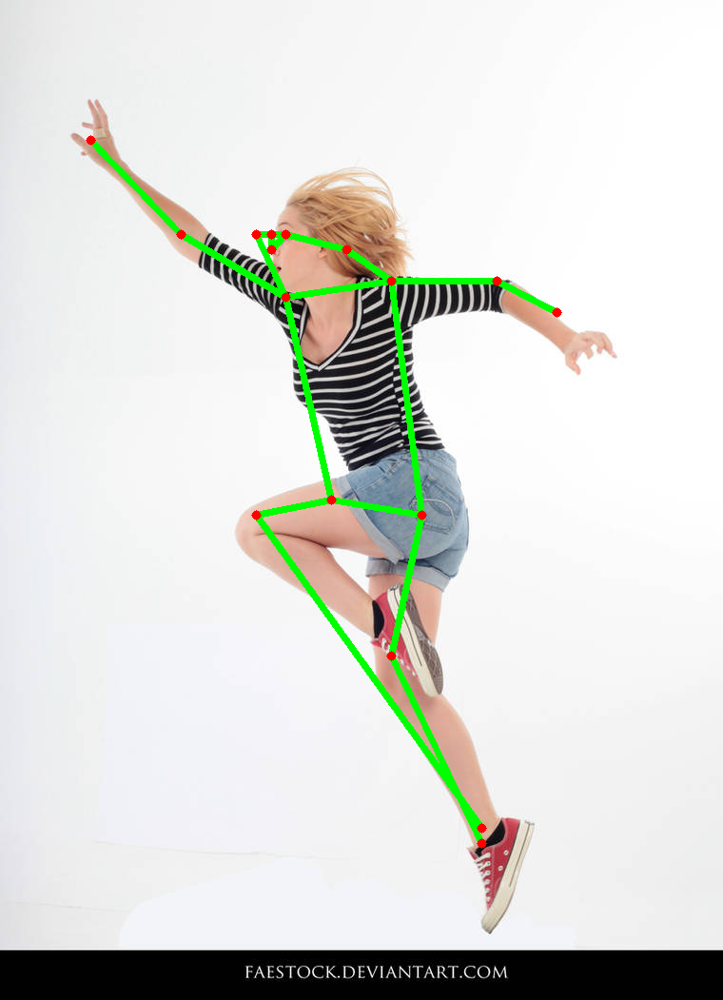
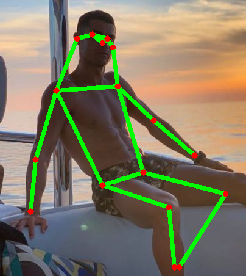

# ML2 Takehome Project

Reimplementing the paper: [Cascaded Pyramid Network for Multi-Person Pose Estimation](https://arxiv.org/abs/1711.07319)

## Dataset

The model uses the COCO dataset which can be downloaded by typing:

```
chmod +x coco.sh
./coco.sh
```

The data is going to be saved inside the `coco/` folder.

I actually got the wrong idea of the assigment from the beginning and didn't relize until I searched for a pytorch code on Github for reference.

That is the data doesn't need to be cropped from the original. I mean not physically cropped to images but just need to write the program to cut it during the training process.
Anyway I did the cutting and save the neccesary information such as keypoints and visual score (0,1,2) to a dataframe for the training and validation data.

```
python dataprocessing/process_data.py
```

## Training

```
python train.py
```

## Test
Download the checkpoint [here](https://drive.google.com/file/d/1RpR1dBJWptwjixI3xtwZ-Q4yAJbkhRLs/view?usp=sharing) and unzip.

```
python test.py
```

The results are shown below, I know that this one is not a perfect one, but if I have more time I think the model will get better.

| Input                            | Prediction                              |
| -------------------------------- | --------------------------------------- |
|    |    |
|  |  |
|    |    |
|       |       |

Failed cases
| Input | Prediction |
| ----------- | ----------- |
| ||
| ||

## Notes

- the model was not finished training yet, then I was not able to test it.
- There was a typo in the code when I created the dataset and I just figured it out on Friday then everything is just like a fresh start. I will keep training and update the weight file and test code as well as the result.

## Reference

The repo is heavily based on the [pytorch version](https://github.com/GengDavid/pytorch-cpn) and [tensorflow version](https://github.com/chenyilun95/tf-cpn) and the official keras tutorial about keypoint estimation.
